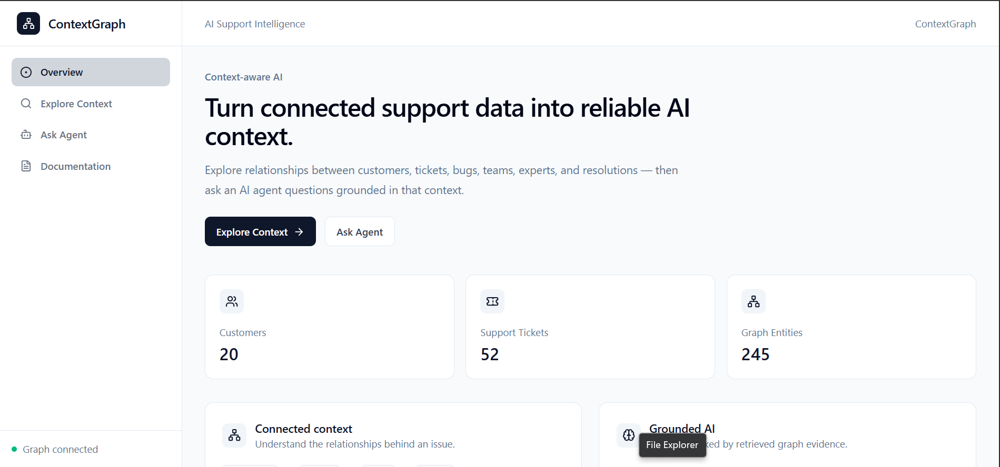
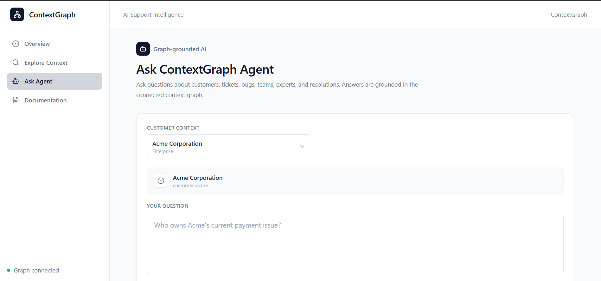
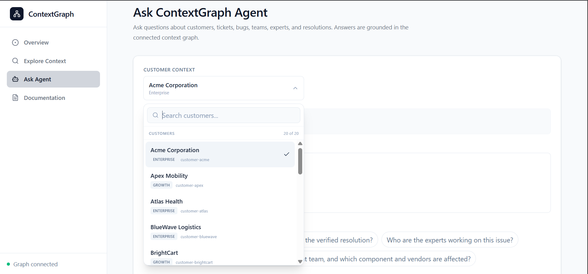
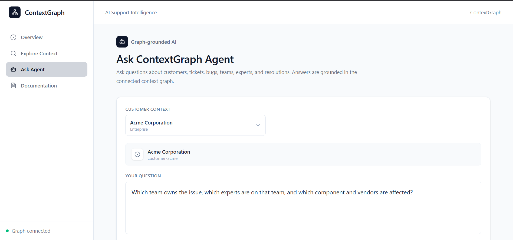
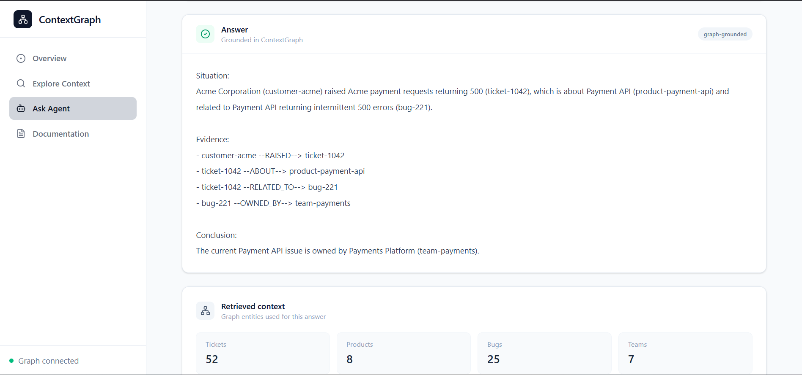
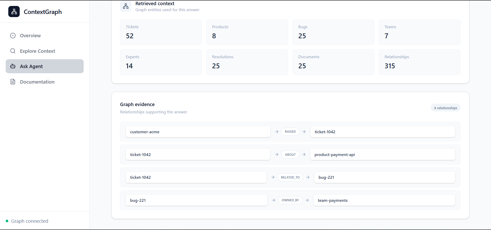
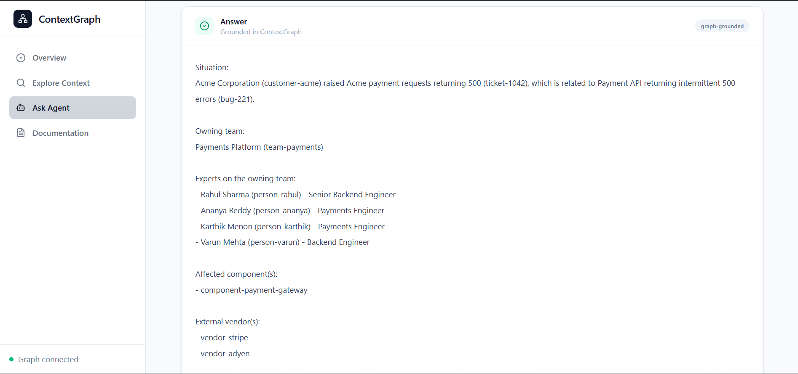
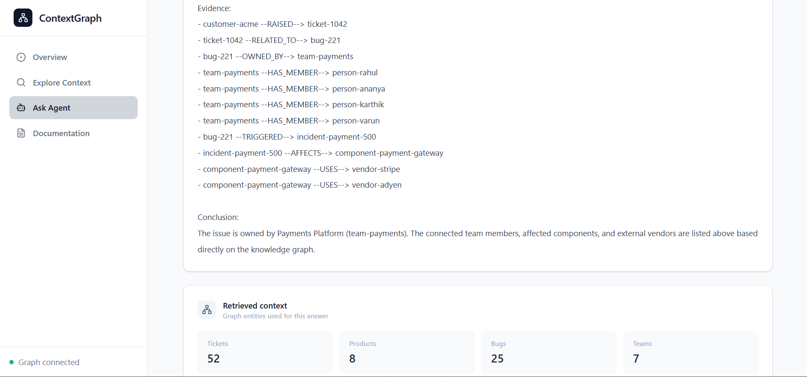
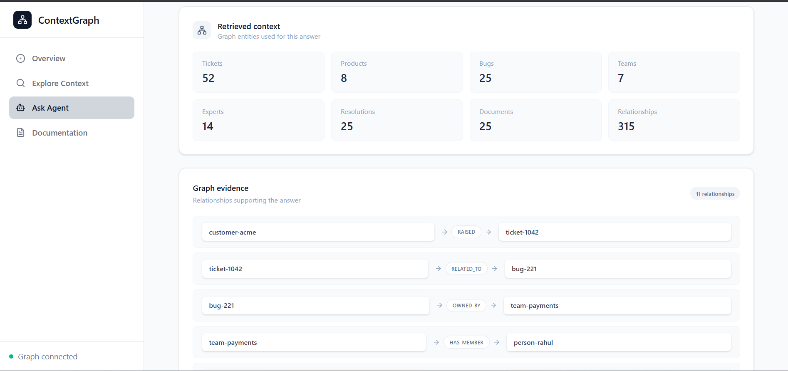
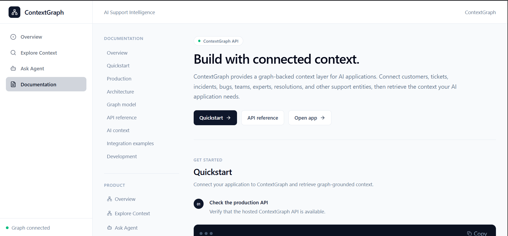

# ContextGraph

ContextGraph is a graph-powered support intelligence platform that connects customers, tickets, bugs, products, teams, experts, incidents, components, vendors, resolutions, and documentation in a unified context graph.

Instead of treating support records as isolated rows, ContextGraph traverses relationships between relevant entities to provide contextual, explainable answers to support questions.

## Contents

- [Production](#production)
- [Overview](#overview)
- [Architecture](#architecture)
- [Graph Model](#graph-model)
- [Getting Started](#getting-started)
- [API Reference](#api-reference)
- [Tech Stack](#tech-stack)
- [Screenshots](#screenshots)
- [Design Principles](#design-principles)

---

## Production

ContextGraph is deployed as separate frontend and backend services.

### Web Application

https://contextgraph-eizw.onrender.com

### Backend API

https://contextgraph-backend.onrender.com/api

### Health Check

https://contextgraph-backend.onrender.com/api/health

The frontend communicates with the ContextGraph API over HTTPS, while the backend connects to the hosted CognoDB graph database.

---

## Overview

A typical support investigation can involve several connected pieces of information:

```text
Customer
   │
   │ RAISED
   ▼
Ticket
   │
   │ RELATED_TO
   ▼
Bug
   ├──────── OWNED_BY ────────> Team
   │                              │
   │                              │ HAS_MEMBER
   │                              ▼
   │                           Person
   │
   └──────── RESOLVED_BY ─────> Resolution
                                  │
                                  │ DOCUMENTED_IN
                                  ▼
                               Document
```

ContextGraph uses these relationships to answer questions such as:

* Who owns the customer's current issue?
* What is the verified resolution?
* Who are the experts working on this issue?
* Which product is affected?
* Which incidents or components are connected?
* Which vendors are involved?
* What documentation supports a resolution?

---

## Why a Graph Database?

The important information in support intelligence is often the **connection between entities**, not just the individual records.

For example, answering:

> Who can help with this customer's current issue?

may require traversing:

```text
Customer
  → Ticket
  → Bug
  → Team
  → Person
```

A relational implementation could represent each entity in a separate table, but the application would then need multiple joins and increasingly complex relationship logic as more entity types are introduced.

With a graph database, the relationship itself is a first-class part of the model:

```cypher
MATCH (customer:Customer {id: $customerId})
      -[:RAISED]->(ticket:Ticket)
      -[:RELATED_TO]->(bug:Bug)
      -[:OWNED_BY]->(team:Team)
      -[:HAS_MEMBER]->(person:Person)

RETURN customer, ticket, bug, team, person
```

This makes multi-hop context retrieval natural and keeps the data model flexible as new entity types and relationships are introduced.

---

## Architecture

```text
                         ┌──────────────────────┐
                         │      React UI        │
                         │ TypeScript + Vite    │
                         └──────────┬───────────┘
                                    │
                                    │ REST API
                                    ▼
                         ┌──────────────────────┐
                         │    Express API       │
                         │      TypeScript      │
                         └──────────┬───────────┘
                                    │
                   ┌────────────────┴────────────────┐
                   │                                 │
                   ▼                                 ▼
          ┌──────────────────┐              ┌──────────────────┐
          │ Graph Repository │              │ AI Context       │
          │                  │              │ Service          │
          └────────┬─────────┘              └────────┬─────────┘
                   │                                 │
                   └──────────────┬──────────────────┘
                                  ▼
                         ┌──────────────────────┐
                         │       CognoDB        │
                         │      Graph Store     │
                         └──────────┬───────────┘
                                    │
                                    ▼
                         ┌──────────────────────┐
                         │ Graph-grounded AI    │
                         │      OpenRouter      │
                         └──────────────────────┘
```

The backend separates:

* HTTP routing and controllers
* Graph repository access
* Graph query definitions
* Customer context retrieval
* AI context construction
* AI provider integration
* Validation and error handling

---

## Graph Model

The graph contains the following main node types:

```text
Customer
Ticket
Bug
Incident
Product
Feature
Component
Team
Person
Resolution
Document
Vendor
Environment
```

Important relationships include:

```text
Customer ──RAISED────────────> Ticket

Ticket ──ABOUT───────────────> Product

Ticket ──RELATED_TO──────────> Bug

Bug ──OWNED_BY───────────────> Team

Team ──HAS_MEMBER────────────> Person

Bug ──RESOLVED_BY────────────> Resolution

Resolution ──DOCUMENTED_IN───> Document

Product ──HAS_FEATURE────────> Feature

Product ──DEPLOYED_IN────────> Environment

Customer ──HAS_INCIDENT──────> Incident

Incident ──AFFECTS───────────> Component

Component ──USES─────────────> Vendor
```

### Example Support Graph

```text
                       Customer
                           │
                         RAISED
                           │
                           ▼
                         Ticket
                       /        \
                   ABOUT        RELATED_TO
                    /              \
                   ▼                ▼
                Product            Bug
                                    │
                    ┌───────────────┼────────────────┐
                    │               │                │
                OWNED_BY       RESOLVED_BY          ...
                    │               │
                    ▼               ▼
                  Team          Resolution
                    │               │
               HAS_MEMBER     DOCUMENTED_IN
                    │               │
                    ▼               ▼
                 Person          Document
```

---

## Seed Data

The repository includes an interconnected demonstration dataset designed to showcase multi-hop graph retrieval and graph-grounded AI.

The current seed graph contains:

* **20 customers**
* **52 tickets**
* **25 bugs**
* **8 products**
* **7 teams**
* **15+ experts/person entities**
* **25 resolutions**
* **25 documents**
* Multiple incidents
* Multiple components
* Multiple vendors
* Product features
* Production environments
* Cross-customer relationships

The customer dataset currently includes:

```text
Acme Corporation
Apex Mobility
Atlas Health
BlueWave Logistics
BrightCart
Cedar Bank
Evergreen Hotels
Greenfield Markets
Harbor Foods
Meridian Insurance
MetroPay
Northstar Media
Nova Retail
Orbit Commerce
Pinnacle Finance
Quantum Systems
Redwood Commerce
Silverline Telecom
Summit Travel
Vertex Labs
```

Example connected support scenarios include:

```text
Acme Corporation
  → Payment API
  → Payment API bug
  → Payments Platform
  → Engineering experts
  → Payment Gateway
  → Stripe / Adyen
  → Payment incident
  → Verified resolution
  → Payment documentation
```

Another example:

```text
Nova Retail
  → Checkout Platform
  → Checkout timeout bug
  → Checkout Engineering
  → Experts
  → Checkout Service
  → Checkout incident
  → Verified resolution
  → Checkout documentation
```

The seed data is intentionally modeled around relationships rather than isolated records. It is suitable for demonstrations and local development; production deployments should use an organization's own support data.

This allows the application to demonstrate:

* Customer-to-ticket traversal
* Ticket-to-bug traversal
* Bug-to-team traversal
* Team-to-expert traversal
* Bug-to-resolution traversal
* Resolution-to-document traversal
* Incident-to-component traversal
* Component-to-vendor traversal
* Multi-hop support investigation

The seed script is included in the backend repository and can be used to populate a CognoDB instance.

### Using Your Own Data

The current seed dataset is provided as demonstration data, but the graph model is not limited to these customers or support scenarios.

Additional customers, tickets, bugs, products, teams, experts, incidents, components, vendors, resolutions, and documents can be added using the same node and relationship structure.

This means the application can be adapted to a different support organization or enterprise dataset without changing the fundamental graph-based architecture.

---

## Graph Queries

Graph queries are kept separately under:

```text
backend/src/graph/queries/
```

The application uses parameterized Cypher queries through the Neo4j JavaScript driver.

### Multi-hop Traversal

One of the main traversals follows:

```text
Customer
  → Ticket
  → Bug
  → Team
  → Person
```

Query:

```cypher
MATCH (customer:Customer {id: $customerId})
      -[:RAISED]->(ticket:Ticket)
      -[:RELATED_TO]->(bug:Bug)
      -[:OWNED_BY]->(team:Team)
      -[:HAS_MEMBER]->(person:Person)

RETURN customer, ticket, bug, team, person
```

This allows the application to discover people connected to the team responsible for a customer's issue.

### Dynamic Context Traversal

ContextGraph also retrieves connected context dynamically:

```cypher
MATCH (customer:Customer {id: $customerId})
MATCH path = (customer)-[*1..4]-(related)

UNWIND relationships(path) AS rel

WITH DISTINCT rel

RETURN
  startNode(rel) AS source,
  rel,
  endNode(rel) AS target
```

This traversal explores up to four hops from a customer and extracts the relationships encountered.

This allows the backend to build a connected context representation without requiring a separate query for every possible combination of support entities.

### Resolution Traversal

A resolution can be reached through:

```text
Customer
  → Ticket
  → Bug
  → Resolution
  → Document
```

Query:

```cypher
MATCH (customer:Customer {id: $customerId})
      -[:RAISED]->(ticket:Ticket)
      -[:RELATED_TO]->(bug:Bug)
      -[:RESOLVED_BY]->(resolution:Resolution)
      -[:DOCUMENTED_IN]->(document:Document)

RETURN
  customer,
  ticket,
  bug,
  resolution,
  document
```

### Parameterized Queries

Application queries use parameters such as:

```text
$customerId
$ticketId
$limit
```

Example:

```cypher
MATCH (customer:Customer {id: $customerId})
RETURN customer
```

User-provided values are passed as query parameters rather than concatenated directly into Cypher statements.

---

## ContextGraph Agent

The AI layer uses customer-specific graph context rather than sending arbitrary database contents to the model.

The flow is:

```text
User Question
      │
      ▼
Customer-specific graph traversal
      │
      ▼
Relevant entities and relationships
      │
      ▼
Context Builder
      │
      ▼
Graph-grounded reasoning
      │
      ▼
Answer + Evidence
```

For supported questions, ContextGraph can construct deterministic answers directly from verified graph relationships.

For questions requiring broader reasoning, the retrieved graph context is passed to the configured AI provider.

This keeps the AI layer focused on relevant customer context and limits exposure of unrelated graph data.

### Example

For Acme Corporation, a question such as:

```text
Who owns the customer's current issue?
```

can be resolved through:

```text
customer-acme
    │
    │ RAISED
    ▼
ticket-1042
    │
    │ RELATED_TO
    ▼
bug-221
    │
    │ OWNED_BY
    ▼
team-payments
```

The resulting answer identifies the owning team from the graph relationship rather than relying only on generated text.

---

## Evidence

Answers can expose the exact relationships used to reach a conclusion.

For example:

```text
customer-acme --RAISED--> ticket-1042

ticket-1042 --ABOUT--> product-payment-api

ticket-1042 --RELATED_TO--> bug-221

bug-221 --OWNED_BY--> team-payments
```

The response can therefore show not only the answer, but also the graph evidence behind it.

Example:

```text
Conclusion:

The current Payment API issue is owned by Payments Platform.

Evidence:

customer-acme --RAISED--> ticket-1042

ticket-1042 --ABOUT--> product-payment-api

ticket-1042 --RELATED_TO--> bug-221

bug-221 --OWNED_BY--> team-payments
```

For broader customer questions, the agent can expose additional relationships such as:

```text
team-payments --HAS_MEMBER--> person-rahul

team-payments --HAS_MEMBER--> person-ananya

team-payments --HAS_MEMBER--> person-karthik

team-payments --HAS_MEMBER--> person-varun

bug-221 --TRIGGERED--> incident-payment-500

incident-payment-500 --AFFECTS--> component-payment-gateway

component-payment-gateway --USES--> vendor-stripe

component-payment-gateway --USES--> vendor-adyen
```

This makes the reasoning path inspectable rather than presenting an unsupported answer without context.

---

## Grounding and Hallucination Protection

ContextGraph prioritizes graph-backed evidence when answering support questions.

The system verifies important relationships before producing deterministic graph-grounded answers.

If the graph does not contain enough information to support a claim, the system can indicate that the available context is insufficient instead of inventing a relationship.

For example, if asked whether a database migration fixed a payment issue and the graph contains no migration-related information, the available graph context cannot establish that claim.

This provides a clear boundary between:

* Information supported by the graph
* Information requiring additional context
* AI-generated reasoning based on retrieved context

The goal is not to make the AI independently authoritative. Instead, the graph acts as the source of structured support context and evidence.

---

## Frontend

The frontend provides three primary areas.

### Overview

Provides a high-level view of the ContextGraph system and its connected support data.

### Explore Context

Interactive graph exploration built with React Flow and D3 Force.

Features include:

* Force-directed graph
* Structured graph view
* Entity search
* Node selection
* Node details
* Relationship inspection
* Connected-node highlighting
* Mini-map
* Zoom and pan controls

The Force view is the default graph view.

### Ask Agent

Allows users to select a customer and ask questions about their connected support context.

The customer selector is populated dynamically from the backend:

```http
GET /api/customers
```

This means the frontend does not maintain a hard-coded customer list.

The response displays:

* Answer
* Model
* Retrieved context
* Entity counts
* Graph evidence
* Supporting relationships

---

## UI

The application is intentionally focused on making connected context easy to inspect.

```text
Overview

Explore Context

Ask Agent
```

The Explore Context page provides:

```text
Graph Search
      +
Force / Structured
      +
Interactive Graph
      +
Node Details
```

The Ask Agent page provides:

```text
Customer Selection
      +
Question
      +
Graph-grounded Answer
      +
Retrieved Context
      +
Graph Evidence
```

The customer selector dynamically retrieves available customers from CognoDB through the backend API.

---

## API Reference

The backend exposes a REST API under:

```text
https://contextgraph-backend.onrender.com/api
```

### Health

```http
GET /api/health
```

Returns the current API status and environment information.

Example:

```bash
curl https://contextgraph-backend.onrender.com/api/health
```

### Customers

```http
GET /api/customers
```

Returns all customers available in the graph.

Example response:

```json
{
  "success": true,
  "data": [
    {
      "id": "customer-acme",
      "name": "Acme Corporation",
      "tier": "Enterprise"
    },
    {
      "id": "customer-nova",
      "name": "Nova Retail",
      "tier": "Enterprise"
    }
  ]
}
```

The frontend uses this endpoint to dynamically populate the customer selector.

### Graph

```http
GET /api/graph
```

Returns the graph nodes and relationships used by the Explore Context interface.

Example:

```bash
curl https://contextgraph-backend.onrender.com/api/graph
```

### Customer Context

```http
GET /api/customers/:customerId/context
```

Retrieves graph context associated with a customer.

### Customer Experts

```http
GET /api/customers/:customerId/experts
```

Discovers experts associated with the customer's support context.

### Customer Resolution

```http
GET /api/customers/:customerId/resolution
```

Retrieves resolution context associated with the customer.

### Customer Agent Context

```http
GET /api/customers/:customerId/agent-context
```

Retrieves customer-specific context used by the agent.

### Similar Tickets

```http
GET /api/customers/tickets/:ticketId/similar
```

Finds tickets with similar graph context.

Optional:

```http
GET /api/customers/tickets/:ticketId/similar?limit=5
```

The backend validates the limit between 1 and 50.

### Customer AI Context

```http
GET /api/ai-context/customers/:customerId
```

Builds customer-specific context for AI processing.

### Ask Agent

```http
POST /api/ai-context/customers/:customerId/query
```

Answers a question using the customer's connected graph context.

Request:

```json
{
  "question": "Who owns the customer's current issue?"
}
```

Example:

```bash
curl -X POST \
  https://contextgraph-backend.onrender.com/api/ai-context/customers/customer-acme/query \
  -H "Content-Type: application/json" \
  -d '{
    "question": "Who owns the customer'\''s current issue?"
  }'
```

### Customer Issue Context

```http
GET /api/ai-context/customers/:customerId/issue-context
```

Returns relationship-grounded context associated with the customer's current issue.

---

## API Response Model

A successful graph request follows the general structure:

```json
{
  "success": true,
  "data": {
    "nodes": [],
    "links": []
  }
}
```

The customer list endpoint follows:

```json
{
  "success": true,
  "data": [
    {
      "id": "customer-acme",
      "name": "Acme Corporation",
      "tier": "Enterprise"
    }
  ]
}
```

An AI query follows the general structure:

```json
{
  "success": true,
  "data": {
    "customerId": "customer-acme",
    "question": "Who owns the customer's current issue?",
    "answer": "...",
    "model": "graph-grounded",
    "evidence": []
  }
}
```

The exact response payload may include additional context depending on the endpoint.

---

## Project Structure

```text
contextgraph/

│
├── backend/
│   ├── src/
│   │   ├── ai/
│   │   │   ├── context/
│   │   │   ├── prompts/
│   │   │   └── providers/
│   │   │
│   │   ├── controllers/
│   │   ├── errors/
│   │   ├── graph/
│   │   │   └── queries/
│   │   ├── middleware/
│   │   ├── repositories/
│   │   ├── routes/
│   │   ├── schemas/
│   │   ├── services/
│   │   └── server.ts
│   │
│   ├── .env.example
│   ├── package.json
│   └── seed.ts
│
├── frontend/
│   ├── src/
│   │   ├── components/
│   │   ├── pages/
│   │   ├── services/
│   │   └── types/
│   │
│   └── package.json
│
├── docs/
│   └── screenshots/
│
├── README.md
└── .gitignore
```

---

## Tech Stack

### Frontend

* React
* TypeScript
* Vite
* Tailwind CSS
* React Flow
* D3 Force
* Axios
* Lucide React

### Backend

* Node.js
* Express
* TypeScript
* Zod
* Neo4j JavaScript Driver
* CognoDB
* openCypher
* OpenRouter

### Database

CognoDB is used as the graph database layer and is accessed using the Neo4j JavaScript driver over Bolt.

The graph model uses nodes and explicit relationships to represent support context.

---

## Environment Variables

Create:

```text
backend/.env
```

Example:

```env
PORT=5000

NODE_ENV=development

FRONTEND_URL=http://localhost:5173

COGNODB_URI=bolt+s://your-instance.databases.cognodb.cloud

COGNODB_USERNAME=cognodb

COGNODB_PASSWORD=your_password

AI_PROVIDER=openrouter

AI_MODELS=z-ai/glm-5.2:free,google/gemma-4-31b-it:free,nvidia/nemotron-3-super-120b-a12b:free

OPENROUTER_API_KEY=your_openrouter_api_key

OPENROUTER_BASE_URL=https://openrouter.ai/api/v1
```

Secrets are stored in environment variables and excluded from source control.

Never commit the actual `.env` file.

---

## CognoDB Setup

1. Create a CognoDB Cloud account.
2. Create a database instance.
3. Copy the generated Bolt connection URI.
4. Save the generated database credentials securely.
5. Add the connection details to `backend/.env`.
6. Run the seed script to populate the graph.
7. Start the backend.
8. Verify the health endpoint.
9. Verify the customer endpoint.
10. Open the frontend and confirm the graph and customer data are loaded.

The application connects through the Neo4j JavaScript driver using the CognoDB Bolt endpoint.

---

## Getting Started

### Prerequisites

- Node.js and npm
- A CognoDB Cloud instance
- An OpenRouter API key for AI-powered queries

### Configure the Environment

Create `backend/.env` using the example in [Environment Variables](#environment-variables). Never commit credentials or other secrets.

### Running Locally

### Backend

```bash
cd backend

npm install

npm run typecheck

npm run build

npm run dev
```

Backend:

```text
http://localhost:5000
```

Health check:

```text
http://localhost:5000/api/health
```

Customer list:

```text
http://localhost:5000/api/customers
```

### Frontend

Open another terminal:

```bash
cd frontend

npm install

npm run build

npm run dev
```

Frontend:

```text
http://localhost:5173
```

---

## Seeding the Graph

The backend includes a seed script for populating the CognoDB graph.

From the backend directory:

```bash
npm run seed
```

The seed process creates interconnected entities representing support scenarios that can be explored through the frontend and queried through the API.

The included dataset is demonstration data. Adapt the seed process for organizational support data while preserving the same graph model and relationship structure.

---

## Validation

### Backend

```bash
cd backend

npm run typecheck

npm run build
```

### Frontend

```bash
cd frontend

npm run build
```

These commands validate the TypeScript code and generate production builds for the respective services.

---

## Screenshots

The screenshots below are stored in the repository under `docs/screenshots/` and demonstrate the implemented application.

### Overview



The Overview page provides a high-level view of the connected support intelligence system.

### Explore Context — Force View


The Force view provides interactive exploration of graph entities and relationships.

### Explore Context — Structured View


The structured view provides a direct representation of graph entities and relationships.

### Explore Context — Tickets


The ticket-focused view allows support relationships to be inspected around ticket entities.


### Ask Agent



The Ask Agent interface allows users to select a customer and ask customer-specific questions using graph-grounded context.

### Ask Agent — Customer Search



The customer selector dynamically loads customers from the backend API rather than using a hard-coded list.

### Agent Query



The interface supports natural-language questions about the selected customer's support context.

### Agent Answer



The agent provides an answer based on the retrieved customer graph context.

### Agent Answer — Expanded Context



The expanded response displays retrieved graph context and supporting relationships.

### Multi-hop Context



Demonstrates traversal across multiple connected support entities.

### Multi-hop Context — Continued



Demonstrates continuation of the multi-hop graph investigation.

### Multi-hop Context — Continued



Demonstrates additional connected support context in the ongoing investigation.

### Documentation



The documentation section explains the ContextGraph concepts and available functionality.

---

## Example Questions

The application can be used to investigate questions such as:

```text
Who owns the customer's current issue?

What is the verified resolution?

Who are the experts working on this issue?

Which product is affected?

Which components are involved?

Which vendors are involved?

What incidents are connected to the issue?

What documentation supports the resolution?

Which team owns the issue, which experts are on that team, and which component and vendors are affected?
```

Example graph-grounded answer:

```text
Situation:

Acme Corporation raised a payment-related support ticket.

Evidence:

customer-acme --RAISED--> ticket-1042

ticket-1042 --ABOUT--> product-payment-api

ticket-1042 --RELATED_TO--> bug-221

bug-221 --OWNED_BY--> team-payments

Conclusion:

The current issue is owned by Payments Platform.
```

A broader investigation can continue through:

```text
team-payments
    │
    ├── HAS_MEMBER ──> person-rahul
    ├── HAS_MEMBER ──> person-ananya
    ├── HAS_MEMBER ──> person-karthik
    └── HAS_MEMBER ──> person-varun

bug-221
    │
    └── TRIGGERED ──> incident-payment-500
                           │
                           └── AFFECTS ──> component-payment-gateway
                                                │
                                                ├── USES ──> vendor-stripe
                                                └── USES ──> vendor-adyen
```

This demonstrates how a single support question can expand into a connected investigation across multiple entity types.

---

## Design Principles

### Relationships Are First-Class Data

The application is designed around connections between support entities rather than isolated records.

### Context Before Generation

The system retrieves relevant graph context before asking an AI provider to answer a question.

### Evidence-Backed Answers

Important answers can expose the exact relationships used to derive the result.

### Parameterized Queries

Graph queries use parameters instead of string-concatenated user input.

### Graph-Grounded Reasoning

The AI layer receives customer-specific graph context instead of arbitrary database contents.

### Dynamic Customer Context

Customer options are retrieved from the backend and ultimately from the graph database instead of being hard-coded into the frontend.

### Graceful Uncertainty

When the graph does not contain enough information, the system avoids presenting an unsupported relationship as fact.

### Clear Separation of Concerns

Graph access, business logic, AI context construction, AI providers, HTTP controllers, and frontend visualization are separated into dedicated layers.

---

## Current Scope

ContextGraph is currently implemented as a focused prototype demonstrating graph-powered support intelligence and graph-grounded AI context.

The current seeded graph contains a broader interconnected dataset than the initial prototype, including:

```text
20 Customers
52 Tickets
25 Bugs
8 Products
7 Teams
15+ Experts
25 Resolutions
25 Documents
Multiple Incidents
Multiple Components
Multiple Vendors
Features
Environments
```

The dataset is designed to demonstrate different support scenarios across multiple customers rather than relying on a single customer journey.

The architecture is designed so additional customers, tickets, incidents, bugs, products, teams, components, vendors, resolutions, and documentation can be added without changing the fundamental graph model.

The included seed data is only a demonstration dataset. The same graph structure can be populated with an organization's own support data.

---

## Extending the Dataset

The graph model is intentionally extensible.

A new customer can be connected to tickets:

```text
Customer
  └── RAISED ──> Ticket
```

A ticket can be connected to a product and bug:

```text
Ticket
  ├── ABOUT ──> Product
  └── RELATED_TO ──> Bug
```

The bug can then connect to its responsible team:

```text
Bug
  └── OWNED_BY ──> Team
```

The team can contain experts:

```text
Team
  └── HAS_MEMBER ──> Person
```

The issue can also connect to operational context:

```text
Bug
  └── TRIGGERED ──> Incident
                       │
                       └── AFFECTS ──> Component
                                          │
                                          └── USES ──> Vendor
```

And resolution knowledge can be connected through:

```text
Bug
  └── RESOLVED_BY ──> Resolution
                         │
                         └── DOCUMENTED_IN ──> Document
```

This allows the same ContextGraph architecture to support larger and more domain-specific datasets.

---

## License

ContextGraph is a prototype focused on graph-based support intelligence and grounded AI context.